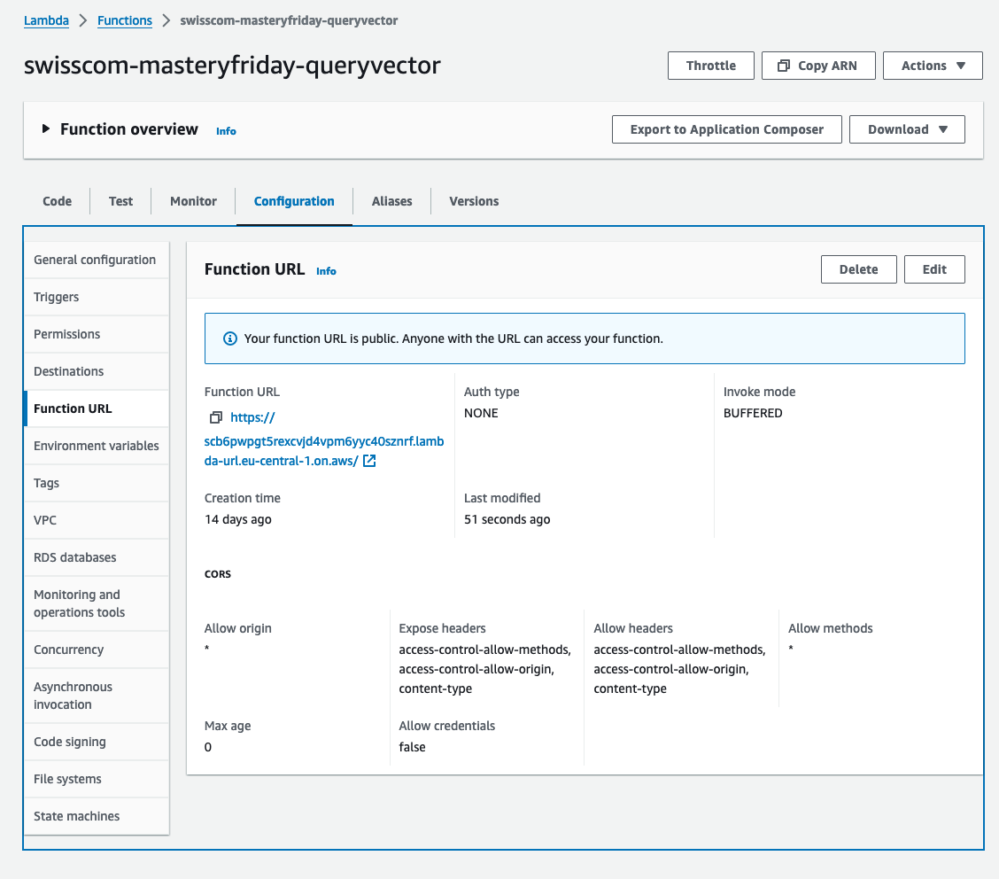
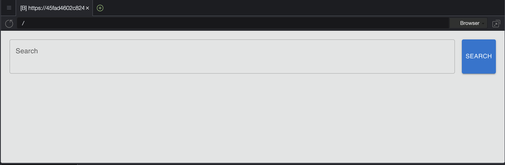

# Swisscom Mastery Friday

Set up instructions for manual setup (no Terraform):
## Backend (lambda) setup
1. Clone the repo in your Cloud9 instance
```bash
git clone https://github.com/phil2211/mastery-session
```
2. In the terminal at the bottom of the screen:
```bash
cd mastery-session/backend
npm install
zip -r backend.zip .
```
3. Upload the backend.zip as new lambda function
4. Set correct CORS headers for the lambda function

## Atlas Setup
1. Dump Data
2. Load Data
3. Create Vector Index
## Frontend (React) setup
1. In the project drawer, click on **Show Hidden Files**

2. Copy `.env` to `.env.local`
3. Set `REACT_APP_LAMBDA_URL` in the `.env.local` file to the Lambda Function URL
   * In te AWS Console: Lambda ⇒ **swisscom-masteryfriday-queryvector** ⇒ Configuration ⇒ Function URL ⇒ Copy Function URL parameter
4. Start the application in the terminal:
```bash
npm start
```
5. Wait for the application to start up on http://localhost:8080

6. Click on Preview ⇒ Preview Running Application

7. The web app should show up with a search box:

8. Enter a prompt and search:

