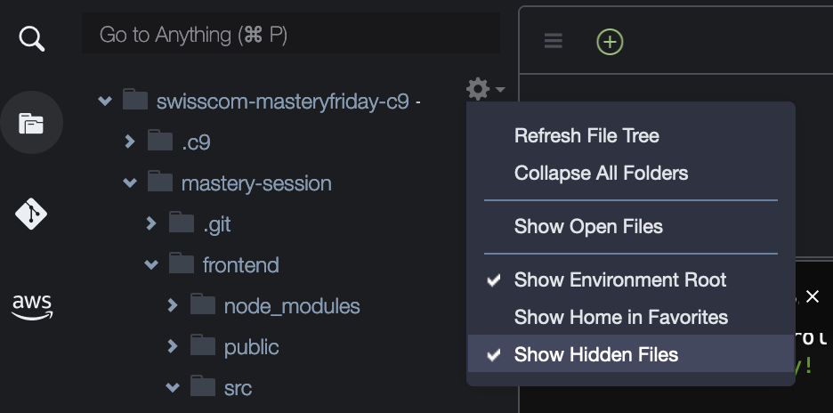
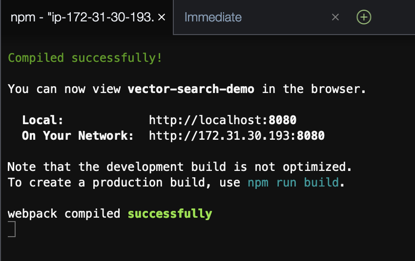
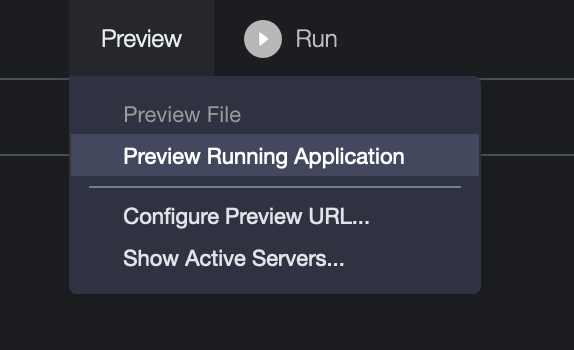
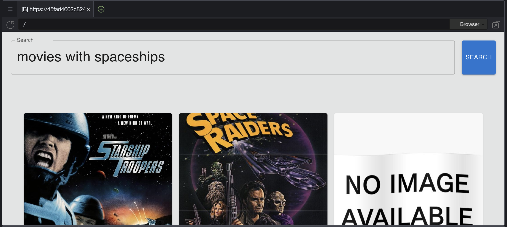

# Swisscom Mastery Friday

Set up instructions:

1. `git clone https://github.com/phil2211/mastery-session`
2. In the terminal at the bottom of the screen:
```bash
cd mastery-session
npm install
```
3. In the project drawer, click on **Show Hidden Files**

4. Edit `.env`
5. Set `REACT_APP_LAMBDA_URL` to the Lambda Function URL
   * In te AWS Console: Lambda ⇒ **swisscom-masteryfriday-queryvector** ⇒ Configuration ⇒ Function URL ⇒ Copy Function URL parameter
6. Start the application in the terminal:
```bash
npm start
```
7. Wait for the application to start up on http://localhost:8080

8. Click on Preview ⇒ Preview Running Application

9. Enter a prompt and search:

